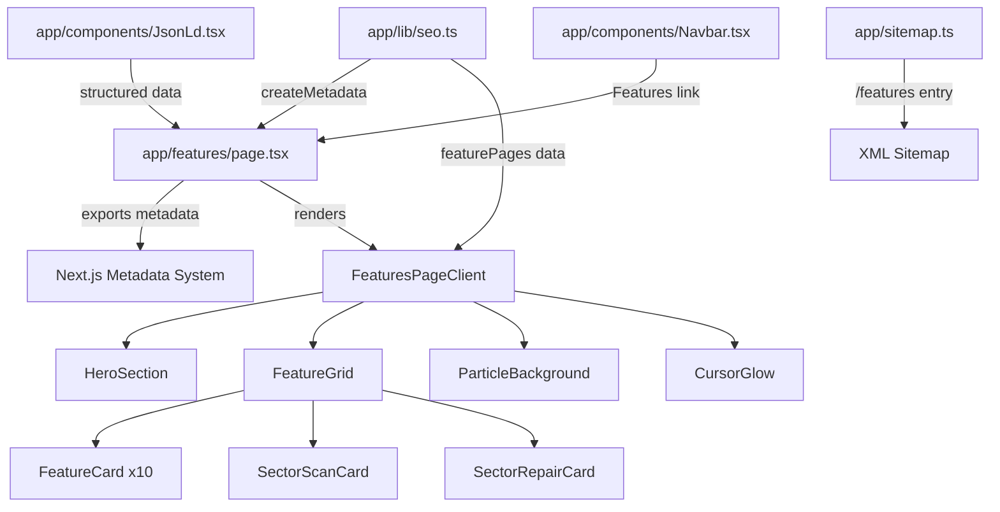

# Design Document: Features Page

## Overview

The `/features` page is a premium showcase page for DriveWatch that displays all 12 core product capabilities in an animated, dark futuristic glassmorphism layout. It serves as a central hub linking to individual feature pages, with a hero section, animated feature cards in a responsive grid, two special animated cards (Sector Surface Scan and Sector Repair), floating particles, cursor-following glow, and full SEO optimization.

The implementation follows the established Next.js 16 pattern: a server component (`app/features/page.tsx`) that exports metadata and renders a client component (`FeaturesPageClient.tsx`) that handles all animations and interactivity.

## Architecture



**File Structure:**
```
app/features/
├── page.tsx              (Server component: metadata + renders client)
└── FeaturesPageClient.tsx (Client component: all UI + animations)
```

**Integration Points:**
- `app/sitemap.ts` — Add `/features` route with priority 0.9
- `app/components/Navbar.tsx` — Add top-level "Features" link to `/features`
- `app/lib/seo.ts` — Use `createMetadata()` for SEO metadata generation

## Components and Interfaces

### 1. Server Page Component (`app/features/page.tsx`)

Exports `metadata` using `createMetadata()` and renders `FeaturesPageClient`. Also renders the `JsonLd` component for structured data.

```typescript
// app/features/page.tsx
import { createMetadata } from "../lib/seo";
import { JsonLd } from "../components/JsonLd";
import FeaturesPageClient from "./FeaturesPageClient";

export const metadata = createMetadata({
  title: "DriveWatch Features - SSD Health, SMART Monitor & Sector Repair",
  description: "DriveWatch offers advanced SSD and HDD monitoring, SMART diagnostics, sector surface scanning, disk repair, and system health tools.",
  path: "/features",
  keywords: ["SSD Health", "HDD Monitor", "SMART Monitor", "Sector Surface Scan", "Sector Repair", "Disk Checker", "Drive Diagnostics"],
});

export default function FeaturesPage() {
  // Renders JsonLd + FeaturesPageClient
}
```

### 2. Client Page Component (`app/features/FeaturesPageClient.tsx`)

"use client" component containing all animated UI. Composed of:

- **ParticleBackground** — 30-80 floating particles with vertical drift
- **HeroSection** — Title, subtitle, animated background blurs, two CTA buttons
- **CursorGlow** — Mouse-following radial gradient glow over the grid area
- **FeatureGrid** — 12 cards in responsive grid with staggered entrance
- **FeatureCard** — Standard glassmorphism card with hover effects
- **SectorScanCard** — Extended card with scan progress bar animation
- **SectorRepairCard** — Extended card with 3-state repair animation

### 3. Feature Data Model

```typescript
interface FeatureItem {
  title: string;
  description: string;
  icon: LucideIcon;
  href?: string; // Link to individual feature page (if applicable)
  id?: string;   // Anchor ID for in-page linking (sector-scan, sector-repair)
}
```

The 12 features with their link mappings:

| # | Title | Link |
|---|-------|------|
| 1 | SSD Health | /ssd-health-monitor |
| 2 | Fan RPM | /fan-rpm-monitor |
| 3 | GPU Temps | /gpu-temperature-monitor |
| 4 | CPU Temps | /cpu-temperature-monitor |
| 5 | Diagnostics | /system-diagnostics |
| 6 | HDD Monitor | /hdd-health-monitor |
| 7 | SSD Check | /ssd-health-check |
| 8 | Drive Scan | /drive-scan-tool |
| 9 | Disk Checker | /disk-health-checker |
| 10 | SMART Monitor | /smart-drive-monitor |
| 11 | Sector Surface Scan | #sector-scan (in-page anchor) |
| 12 | Sector Repair / Stabilization | #sector-repair (in-page anchor) |

### 4. Navbar Modification

Add a top-level "Features" link in the desktop navigation (before the existing Features dropdown) that navigates to `/features`. On mobile, add it as a top-level item in the drawer.

### 5. Sitemap Modification

Add a static route entry for `/features` with priority 0.9 and changeFrequency "weekly".

## Data Models

### Feature Data Array

A constant array of 12 `FeatureItem` objects defined within `FeaturesPageClient.tsx`:

```typescript
const features: FeatureItem[] = [
  { title: "SSD Health", description: "Monitor SSD lifespan, wear level, and health status in real time.", icon: HardDrive, href: "/ssd-health-monitor" },
  { title: "Fan RPM", description: "Track system fan speeds and cooling performance.", icon: Fan, href: "/fan-rpm-monitor" },
  { title: "GPU Temps", description: "Live GPU temperature monitoring with overheating alerts.", icon: Thermometer, href: "/gpu-temperature-monitor" },
  { title: "CPU Temps", description: "Monitor processor temperatures and thermal behavior.", icon: Cpu, href: "/cpu-temperature-monitor" },
  { title: "Diagnostics", description: "Advanced hardware diagnostics for system stability and drive reliability.", icon: Activity, href: "/system-diagnostics" },
  { title: "HDD Monitor", description: "Track HDD performance, bad sectors, and read/write behavior.", icon: Database, href: "/hdd-health-monitor" },
  { title: "SSD Check", description: "Analyze SSD condition, endurance, and SMART data.", icon: ShieldCheck, href: "/ssd-health-check" },
  { title: "Drive Scan", description: "Deep disk scanning for errors, unstable sectors, and failures.", icon: Search, href: "/drive-scan-tool" },
  { title: "Disk Checker", description: "Detect filesystem issues and corrupted sectors.", icon: CheckCircle, href: "/disk-health-checker" },
  { title: "SMART Monitor", description: "Real-time SMART attribute analysis and warnings.", icon: LineChart, href: "/smart-drive-monitor" },
  { title: "Sector Surface Scan", description: "Perform low-level sector-by-sector surface analysis to detect damaged, weak, slow, or unstable sectors.", icon: Radar, id: "sector-scan" },
  { title: "Sector Repair / Stabilization", description: "Attempt recovery and stabilization of weak or unstable disk sectors using advanced repair algorithms.", icon: Wrench, id: "sector-repair" },
];
```

### JSON-LD Structured Data

```typescript
const featuresJsonLd = {
  "@context": "https://schema.org",
  "@type": "WebPage",
  name: "DriveWatch Features - SSD Health, SMART Monitor & Sector Repair",
  description: "DriveWatch offers advanced SSD and HDD monitoring, SMART diagnostics, sector surface scanning, disk repair, and system health tools.",
  mainEntity: {
    "@type": "ItemList",
    itemListElement: features.map((feature, index) => ({
      "@type": "ListItem",
      position: index + 1,
      name: feature.title,
    })),
  },
  publisher: {
    "@type": "Organization",
    name: "DriveWatch",
    url: "https://www.drivewatch.site",
  },
};
```

## Correctness Properties

*A property is a characteristic or behavior that should hold true across all valid executions of a system — essentially, a formal statement about what the system should do. Properties serve as the bridge between human-readable specifications and machine-verifiable correctness guarantees.*

### Property 1: Feature content rendering completeness

*For any* feature in the features data array, the rendered Feature_Grid SHALL produce a card element containing that feature's exact title text and exact description text.

**Validates: Requirements 5.1, 5.2, 5.3, 5.4, 5.5, 5.6, 5.7, 5.8, 5.9, 5.10, 5.11, 5.12**

### Property 2: Feature card internal linking correctness

*For any* feature in the features data array that has a corresponding `href` property (linking to an individual feature page), the rendered card SHALL contain an anchor element whose `href` attribute matches that feature's target URL.

**Validates: Requirements 11.4**

### Property 3: Feature card semantic structure

*For any* rendered feature card in the Feature_Grid, the card SHALL use a semantic HTML element (`<article>`) and SHALL contain exactly one heading element at the `<h3>` level.

**Validates: Requirements 13.2**

## Error Handling

| Scenario | Handling Strategy |
|----------|-------------------|
| Framer Motion fails to load | All content renders in static layout via CSS defaults; no empty containers |
| Feature data array is empty | Grid section renders with no cards; no runtime error |
| Invalid href on feature card | Link renders but navigates to 404; no crash |
| prefers-reduced-motion enabled | All animations disabled via CSS media query and Framer Motion `reducedMotion` prop |
| Mouse events not available (touch) | Cursor glow hidden; no error thrown |
| GSAP fails to load | Particle animation falls back to CSS keyframes or static particles |

## Testing Strategy

### Unit Tests (Example-Based)
- Verify page renders with correct metadata export values
- Verify Hero section contains h1 with exact title text
- Verify two CTA buttons with correct href attributes
- Verify 12 feature cards render in the grid
- Verify sitemap includes `/features` entry with priority 0.9
- Verify JSON-LD structured data schema is valid
- Verify Sector Scan card contains progress bar element
- Verify Sector Repair card contains 3 state indicators
- Verify navbar contains "Features" link to `/features`

### Property Tests
- **Property 1**: Generate feature data items and verify rendered output contains title + description for each
- **Property 2**: Generate features with href values and verify rendered links match
- **Property 3**: Render all cards and verify each uses `<article>` with exactly one `<h3>`

### Integration Tests
- Full page render at 1024px, 768px, and 375px viewports — verify grid columns
- Navigation flow: click "Features" in navbar → arrives at `/features`
- Click feature card → navigates to correct individual feature page

### Property-Based Testing Configuration
- Library: No PBT library needed for this feature — the properties are best validated with parameterized example-based tests iterating over the features data array (since the input space is a fixed 12-item array, not a generative domain)
- Each test iterates over all 12 features to verify the property holds for each
- Tag format: **Feature: features-page, Property {N}: {title}**
