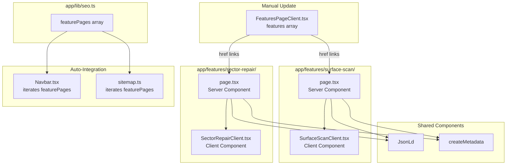

# Design Document: Surface Scan & Sector Repair Pages

## Overview

This design adds two premium, SEO-optimized feature pages to the DriveWatch site: **Surface Scan** (`/features/surface-scan`) and **Sector Repair** (`/features/sector-repair`). Unlike the existing feature pages that use the generic `SeoFeaturePage` component with data from the `featurePages` array, these pages require **custom client components** with rich animated visualizations (scanning effects, repair pulse animations, sector grids) that go beyond what the template supports.

Both pages follow the established server/client component split:
- **Server component** (`page.tsx`): exports metadata via `createMetadata()`, renders `JsonLd` for structured data, and mounts the client component.
- **Client component** (`*Client.tsx`): handles all UI, animations (Framer Motion), and interactivity.

Integration into the navbar, sitemap, and features overview page is achieved by adding entries to the `featurePages` array in `app/lib/seo.ts` and updating the features grid data in `FeaturesPageClient.tsx`.

### Design Decisions

1. **Custom client components over SeoFeaturePage**: The requirements call for animated scanning visualizations, repair pulse effects, and sector grid animations that the generic `SeoFeaturePage` template cannot accommodate. Custom components allow full creative control while still following the same server/client split pattern.

2. **featurePages array entries still needed**: Even though these pages don't use `SeoFeaturePage` for rendering, they need entries in `featurePages` so the navbar dropdown and sitemap automatically include them. The entries will have a reduced `sections` array (used only for JSON-LD `mainEntity` data, not for rendering).

3. **No new dependencies**: All animations use Framer Motion (already installed) and CSS keyframes. Icons come from Lucide React. No additional packages required.

## Architecture



### Request Flow

1. User navigates to `/features/surface-scan` or `/features/sector-repair`
2. Next.js resolves the route to the corresponding `page.tsx` (server component)
3. Server component exports static metadata (title, description, OG, Twitter, canonical)
4. Server component renders `JsonLd` with structured data + the client component
5. Client component hydrates on the browser with Framer Motion animations

### Integration Flow

1. Adding entries to `featurePages` in `seo.ts` automatically:
   - Adds links to the Navbar Features dropdown (desktop + mobile)
   - Adds URLs to the XML sitemap with `priority: 0.88` and `changeFrequency: "monthly"`
2. Updating the `features` array in `FeaturesPageClient.tsx`:
   - Changes `id: "sector-scan"` → `href: "/features/surface-scan"`
   - Changes `id: "sector-repair"` → `href: "/features/sector-repair"`
   - Cards render as `<Link>` elements instead of static `<article>` elements

## Components and Interfaces

### Server Components

#### `app/features/surface-scan/page.tsx`

```typescript
import type { Metadata } from "next";
import { createMetadata } from "../../lib/seo";
import { JsonLd } from "../../components/JsonLd";
import SurfaceScanClient from "./SurfaceScanClient";

export const metadata: Metadata = createMetadata({
  title: "DriveWatch Surface Scan - Detect Bad & Weak Disk Sectors",
  description: "Perform deep sector-by-sector surface analysis to detect damaged, weak, slow, or unstable disk sectors with DriveWatch's advanced scanning technology.",
  path: "/features/surface-scan",
  keywords: ["surface scan", "sector scan", "bad sector detection", "disk surface analysis", "weak sectors"],
});

// Renders JsonLd + SurfaceScanClient
```

#### `app/features/sector-repair/page.tsx`

```typescript
import type { Metadata } from "next";
import { createMetadata } from "../../lib/seo";
import { JsonLd } from "../../components/JsonLd";
import SectorRepairClient from "./SectorRepairClient";

export const metadata: Metadata = createMetadata({
  title: "DriveWatch Sector Repair - Stabilize & Recover Disk Sectors",
  description: "Advanced sector stabilization and recovery system for weak and unstable drive sectors using DriveWatch's repair algorithms.",
  path: "/features/sector-repair",
  keywords: ["sector repair", "sector stabilization", "disk recovery", "bad sector repair", "drive repair"],
});

// Renders JsonLd + SectorRepairClient
```

### Client Components

#### `SurfaceScanClient.tsx` — Section Structure

```typescript
"use client";

// Imports: React, framer-motion, lucide-react icons

// Internal section components:
// - HeroSection: Animated scanning visualization + title + CTAs
// - WhatIsSurfaceScan: Educational content with glass-card
// - HowDetectsBadSectors: Technical explanation with icon grid
// - SsdVsHddAnalysis: Comparison layout with two glass-cards
// - RealtimeScanVisualization: Animated sector grid demo
// - SectorHealthMonitoring: Monitoring features with benefit list
// - FaqSection: Expandable FAQ items
// - FinalCtaSection: Download CTA with gradient background

export default function SurfaceScanClient() {
  // Uses useReducedMotion() for accessibility
  // Renders all sections in order
}
```

#### `SectorRepairClient.tsx` — Section Structure

```typescript
"use client";

// Imports: React, framer-motion, lucide-react icons

// Internal section components:
// - HeroSection: Repair pulse animation + title + CTAs
// - HowRepairWorks: Process explanation with step indicators
// - StabilizationTechnology: Technical deep-dive with glass-cards
// - RecoveryProcess: Animated state machine (scanning → repairing → recovered)
// - PreventingDataLoss: Benefits and protection features
// - SmartHealthIntegration: SMART attribute connection explanation
// - FaqSection: Expandable FAQ items
// - FinalCtaSection: Download CTA with gradient background

export default function SectorRepairClient() {
  // Uses useReducedMotion() for accessibility
  // Renders all sections in order
}
```

### Shared Animation Patterns

Both client components reuse these animation patterns:

| Pattern | Implementation | Usage |
|---------|---------------|-------|
| Section reveal | `motion.div` with `whileInView` + `viewport={{ once: true }}` | Every content section |
| Stagger children | Parent `variants` with `staggerChildren: 0.1` | Card grids, benefit lists |
| Hover glow | `hover:neon-outline` + `hover:-translate-y-1` | Glass cards |
| Reduced motion | `useReducedMotion()` → skip animations | All animated elements |
| Background glow orbs | Absolute-positioned blurred divs | Hero sections |

### Component Props Interface

```typescript
// No external props needed — both client components are self-contained
// Internal section components receive:
interface SectionProps {
  reducedMotion: boolean;
}
```

## Data Models

### featurePages Entries (app/lib/seo.ts)

Two new entries appended to the `featurePages` array:

```typescript
// Surface Scan entry
{
  slug: "/features/surface-scan",
  navTitle: "Surface Scan",
  metaTitle: "DriveWatch Surface Scan - Detect Bad & Weak Disk Sectors",
  metaDescription: "Perform deep sector-by-sector surface analysis to detect damaged, weak, slow, or unstable disk sectors with DriveWatch's advanced scanning technology.",
  keywords: [
    "surface scan",
    "sector scan",
    "bad sector detection",
    "disk surface analysis",
    "weak sectors",
    "sector surface scan",
  ],
  eyebrow: "Sector surface scan",
  title: "Deep sector-by-sector disk analysis for detecting damaged, weak, unstable, or slow sectors",
  description: "DriveWatch performs low-level surface scanning to map every sector on your drive, identifying damaged, weak, slow, and unstable areas before they cause data loss.",
  stat: "100%",
  statLabel: "Sector Coverage",
  sections: [
    { title: "What is Surface Scan", description: "A low-level sector-by-sector analysis that reads every addressable block on your drive to detect physical and logical damage." },
    { title: "How DriveWatch Detects Bad Sectors", description: "Advanced read-verify algorithms test each sector's response time and data integrity to classify sector health status." },
    { title: "SSD vs HDD Sector Analysis", description: "Different scanning strategies optimized for flash memory cells versus magnetic platters ensure accurate results on any drive type." },
  ],
  benefits: [
    "Detect damaged sectors before data loss occurs",
    "Identify slow and unstable sectors affecting performance",
    "Map entire drive surface with sector-level granularity",
    "Distinguish between recoverable and permanently failed sectors",
  ],
  faqs: [
    { question: "How long does a surface scan take?", answer: "Scan duration depends on drive size and speed. A 1TB HDD typically takes 2-4 hours for a full surface scan, while NVMe SSDs complete in minutes." },
    { question: "Will a surface scan damage my drive?", answer: "No. Surface scanning performs read-only operations that do not write data or consume SSD write cycles." },
    { question: "Can I use my computer during a scan?", answer: "Yes. DriveWatch runs scans at low priority so your system remains responsive during the analysis." },
  ],
  relatedSlugs: ["/features/sector-repair", "/drive-scan-tool"],
}

// Sector Repair entry
{
  slug: "/features/sector-repair",
  navTitle: "Sector Repair",
  metaTitle: "DriveWatch Sector Repair - Stabilize & Recover Disk Sectors",
  metaDescription: "Advanced sector stabilization and recovery system for weak and unstable drive sectors using DriveWatch's repair algorithms.",
  keywords: [
    "sector repair",
    "sector stabilization",
    "disk recovery",
    "bad sector repair",
    "drive repair",
    "sector recovery",
  ],
  eyebrow: "Sector repair & stabilization",
  title: "Advanced sector stabilization and recovery for weak and unstable drive sectors",
  description: "DriveWatch uses intelligent repair algorithms to stabilize weak sectors, recover readable data from failing areas, and remap damaged blocks to preserve drive integrity.",
  stat: "95%",
  statLabel: "Recovery Rate",
  sections: [
    { title: "How Sector Repair Works", description: "DriveWatch reads weak sectors multiple times with varying parameters, reconstructs data using ECC, and triggers firmware-level reallocation." },
    { title: "Stabilization Technology", description: "Proprietary algorithms refresh magnetic charge on HDD sectors and optimize flash cell voltage thresholds on SSDs to extend sector life." },
    { title: "Recovery Process", description: "A three-phase approach: identify failing sectors, attempt data recovery, then remap to spare areas to prevent future access failures." },
  ],
  benefits: [
    "Recover data from failing sectors before permanent loss",
    "Stabilize weak sectors to extend drive lifespan",
    "Automatic bad sector reallocation via firmware commands",
    "Integrated SMART health monitoring during repair",
  ],
  faqs: [
    { question: "Can sector repair fix a failing drive?", answer: "Sector repair can stabilize and recover weak sectors, but it cannot reverse physical damage. It is most effective as a preventive measure on drives showing early warning signs." },
    { question: "Is sector repair safe for SSDs?", answer: "Yes. DriveWatch uses SSD-appropriate techniques that work with the drive's wear leveling and garbage collection rather than against them." },
    { question: "How long does sector repair take?", answer: "Repair time depends on the number of affected sectors. A drive with a few dozen weak sectors typically completes in 15-30 minutes." },
  ],
  relatedSlugs: ["/features/surface-scan", "/smart-drive-monitor"],
}
```

### JSON-LD Structured Data

#### Surface Scan JSON-LD

```json
{
  "@context": "https://schema.org",
  "@type": "SoftwareApplication",
  "name": "DriveWatch Surface Scan",
  "applicationCategory": "UtilitiesApplication",
  "operatingSystem": "Windows",
  "description": "Perform deep sector-by-sector surface analysis to detect damaged, weak, slow, or unstable disk sectors.",
  "url": "https://www.drivewatch.site/features/surface-scan",
  "publisher": {
    "@type": "Organization",
    "name": "DriveWatch",
    "url": "https://www.drivewatch.site"
  },
  "offers": {
    "@type": "Offer",
    "price": "0",
    "priceCurrency": "USD"
  }
}
```

#### Sector Repair JSON-LD

```json
{
  "@context": "https://schema.org",
  "@type": "SoftwareApplication",
  "name": "DriveWatch Sector Repair",
  "applicationCategory": "UtilitiesApplication",
  "operatingSystem": "Windows",
  "description": "Advanced sector stabilization and recovery system for weak and unstable drive sectors.",
  "url": "https://www.drivewatch.site/features/sector-repair",
  "publisher": {
    "@type": "Organization",
    "name": "DriveWatch",
    "url": "https://www.drivewatch.site"
  },
  "offers": {
    "@type": "Offer",
    "price": "0",
    "priceCurrency": "USD"
  }
}
```

### FeaturesPageClient.tsx Data Changes

```typescript
// Before:
{ title: "Sector Surface Scan", ..., icon: Radar, id: "sector-scan" },
{ title: "Sector Repair / Stabilization", ..., icon: Wrench, id: "sector-repair" },

// After:
{ title: "Sector Surface Scan", ..., icon: Radar, href: "/features/surface-scan" },
{ title: "Sector Repair / Stabilization", ..., icon: Wrench, href: "/features/sector-repair" },
```

## Animation Specifications

### Surface Scan Page — Hero Animation

| Element | Animation | Duration | Easing |
|---------|-----------|----------|--------|
| Sector grid (8×8) | Cells light up sequentially (scan line sweep) | 4s loop | `ease-in-out` |
| Scan line | Horizontal bar moves top-to-bottom across grid | 3s loop | `linear` |
| Progress bar | Width animates 0% → 100% | 5s loop | `ease-in-out` |
| Glow pulse | Opacity oscillates 0.4 → 1 | 2s loop | `ease-in-out` |
| Background orbs | Subtle float with blur | 10s loop | `ease-in-out` |
| Title text | Fade in + slide up on mount | 0.7s once | `spring` |

**Sector Grid Visualization:**
- 8×8 CSS grid of small rounded squares
- Each cell has one of 4 states: `healthy` (green), `slow` (yellow), `weak` (orange), `damaged` (red)
- Scan line sweeps across rows, revealing cell states progressively
- Uses CSS `animation-delay` per cell for stagger effect

### Sector Repair Page — Hero Animation

| Element | Animation | Duration | Easing |
|---------|-----------|----------|--------|
| Repair pulse | Concentric rings expand outward from center | 3s loop | `ease-out` |
| Status indicators | Three dots cycle through states (red → amber → green) | 3s loop, staggered 1s | `ease-in-out` |
| Recovery progress | Segmented bar fills left-to-right | 4s loop | `ease-in-out` |
| Sector cells | Individual cells transition from red → green | 2s per cell, staggered | `ease-in-out` |
| Background orbs | Subtle float with blur | 10s loop | `ease-in-out` |
| Title text | Fade in + slide up on mount | 0.7s once | `spring` |

**Repair Visualization:**
- Central "repair beam" with expanding concentric rings
- 3 status indicators: Scanning (red), Repairing (amber), Recovered (green)
- Small sector grid showing cells transitioning from damaged to healthy

### Shared Animation Specs

| Pattern | Framer Motion Config |
|---------|---------------------|
| Section reveal | `initial={{ opacity: 0, y: 30 }}`, `whileInView={{ opacity: 1, y: 0 }}`, `transition={{ duration: 0.6 }}` |
| Card stagger | Parent: `staggerChildren: 0.1`, Child: `variants={{ hidden: { opacity: 0, y: 20 }, visible: { opacity: 1, y: 0 } }}` |
| CTA hover | `whileHover={{ scale: 1.05 }}`, `whileTap={{ scale: 0.95 }}` |
| Reduced motion | All animations disabled; static final state rendered immediately |

### CSS Keyframe Animations (in component `<style>` tags)

```css
/* Surface Scan */
@keyframes scanSweep {
  0% { transform: translateY(0); }
  100% { transform: translateY(100%); }
}

@keyframes sectorReveal {
  0% { opacity: 0.2; transform: scale(0.8); }
  100% { opacity: 1; transform: scale(1); }
}

/* Sector Repair */
@keyframes repairPulse {
  0% { transform: scale(0.5); opacity: 0.8; }
  100% { transform: scale(2.5); opacity: 0; }
}

@keyframes cellRecover {
  0% { background-color: rgb(248, 113, 113); }
  50% { background-color: rgb(251, 191, 36); }
  100% { background-color: rgb(52, 211, 153); }
}
```

## Error Handling

### Build-Time Errors

| Scenario | Handling |
|----------|----------|
| Missing `featurePages` entry | `getFeaturePage()` throws with descriptive error message at build time — caught during `next build` |
| Invalid metadata fields | TypeScript type checking via `Metadata` type from Next.js ensures all required fields are present |
| Missing icon imports | TypeScript compilation error — caught at build time |

### Runtime Errors

| Scenario | Handling |
|----------|----------|
| Framer Motion fails to load | Components render without animations (static layout still functional) |
| `useReducedMotion()` returns null | Fallback to `false` (animations enabled) via `?? false` |
| CSS animation not supported | Graceful degradation — elements render in final state without animation |
| JavaScript disabled | Server-rendered HTML provides full content; animations simply don't run |

### SEO Error Prevention

| Scenario | Prevention |
|----------|-----------|
| Duplicate canonical URLs | Each page has a unique `path` parameter in `createMetadata()` |
| Missing JSON-LD | Server component always renders `<JsonLd>` before client component |
| Broken internal links | `featurePages` slugs match actual route paths; TypeScript ensures consistency |
| 404 on new routes | File-based routing in Next.js — creating `page.tsx` at the correct path guarantees the route exists |

## Testing Strategy

### Why Property-Based Testing Does Not Apply

This feature consists of:
- **UI rendering** (React components with animations)
- **Static SEO configuration** (metadata objects, JSON-LD)
- **Data array entries** (featurePages additions)
- **CSS styling** (glassmorphism, animations)

None of these involve pure functions with meaningful input variation, universal properties across a wide input space, or algorithmic logic. All testable criteria are best covered by **example-based unit tests** and **smoke tests**.

### Unit Tests (Example-Based)

| Test | What it verifies | Criteria |
|------|-----------------|----------|
| Surface Scan metadata title | Exact title string matches requirement | 3.1 |
| Sector Repair metadata title | Exact title string matches requirement | 4.1 |
| Surface Scan metadata fields | All required fields present (description, keywords, OG, twitter, canonical) | 3.2 |
| Sector Repair metadata fields | All required fields present | 4.2 |
| featurePages contains surface-scan | Entry with slug `/features/surface-scan` exists | 6.3 |
| featurePages contains sector-repair | Entry with slug `/features/sector-repair` exists | 6.3 |
| Surface Scan client renders hero | Component mounts, title and CTAs present in DOM | 1.1 |
| Surface Scan client renders all sections | All 7 section headings present | 1.2 |
| Sector Repair client renders hero | Component mounts, title and CTAs present in DOM | 2.1 |
| Sector Repair client renders all sections | All 7 section headings present | 2.2 |
| Features page links to surface-scan | Features array entry has `href: "/features/surface-scan"` | 8.1 |
| Features page links to sector-repair | Features array entry has `href: "/features/sector-repair"` | 8.2 |

### Smoke Tests

| Test | What it verifies | Criteria |
|------|-----------------|----------|
| `next build` succeeds | No TypeScript errors, all routes resolve, metadata exports valid | 5.1–5.4, 10.1–10.2 |
| Sitemap includes both URLs | Generated sitemap XML contains both new URLs | 6.1, 6.2 |

### Manual Verification

| Check | What it verifies | Criteria |
|-------|-----------------|----------|
| Visual inspection of animations | Scanning effects, repair pulse, sector grid look correct | 1.4, 2.4 |
| Responsive layout testing | Pages render correctly at 375px, 768px, 1440px | 9.3 |
| Navbar dropdown shows new links | Links appear and highlight correctly | 7.1–7.3 |
| Lighthouse SEO audit | Score ≥ 95 for both pages | 3.2, 4.2 |
| Reduced motion preference | Animations disabled when OS preference is set | 9.2 |

### Test Framework

- **Build verification**: `next build` (already in CI)
- **Unit tests**: Can be added with the project's existing tooling if a test framework is set up (e.g., Vitest + React Testing Library)
- **Manual QA**: Browser DevTools responsive mode + Lighthouse
